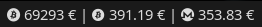

# i3blocks Crypto Prices

Script Bash pour afficher les prix en temps réel de **Bitcoin (BTC), Bitcoin Cash (BCH) et Monero (XMR)** dans la barre **i3blocks** (i3WM).

Les données proviennent de l'API **CoinGecko** (clé Demo gratuite requise) et les icônes proviennent de **Nerd Fonts**.

---

## Fonctionnalités

- Affichage en EUR (ou toute devise via variable d'environnement)
- Mise en cache locale (60 min par défaut) pour limiter les appels API
- Journalisation dans `~/.cache/crypto_prices/crypto_prices.log` (rotation à 1 Mo)
- Clé API lue depuis une variable d'environnement ou un fichier secret, jamais codée en dur
- Compatible i3blocks

---

## Installation

### 1) Cloner le dépôt
```bash
git clone https://github.com/seeraiwer/i3blocks-crypto.git
cd i3blocks-crypto
```

### 2) Installer les dépendances
Requis : `bash`, `curl`, `jq` et une police **Nerd Fonts**.

```bash
# Arch
sudo pacman -S jq curl ttf-nerd-fonts-symbols
```

### 3) Installer le script
```bash
mkdir -p ~/.config/i3/scripts
cp crypto_prices.sh ~/.config/i3/scripts/crypto_prices.sh
chmod +x ~/.config/i3/scripts/crypto_prices.sh
```

### 4) Clé API CoinGecko

Obtenir une clé Demo gratuite sur [coingecko.com/en/api](https://www.coingecko.com/en/api), puis la stocker dans un fichier secret :

```bash
mkdir -p ~/.config/i3/secrets
echo "VOTRE_CLE_ICI" > ~/.config/i3/secrets/coingecko_apikey
chmod 600 ~/.config/i3/secrets/coingecko_apikey
```

Ou via variable d'environnement :
```bash
export COINGECKO_API_KEY="VOTRE_CLE_ICI"
```

### 5) Ajouter le module i3blocks
Dans `~/.config/i3blocks/config` :
```ini
[crypto_prices]
command=~/.config/i3/scripts/crypto_prices.sh
interval=3600
```

### 6) Recharger i3blocks
```bash
pkill -SIGUSR1 i3blocks
```

---

## Configuration

Toutes les options passent par des variables d'environnement :

| Variable              | Défaut                              | Description                          |
|-----------------------|-------------------------------------|--------------------------------------|
| `COINGECKO_API_KEY`   | —                                   | Clé API CoinGecko                    |
| `COINGECKO_KEYFILE`   | —                                   | Chemin alternatif vers le fichier clé |
| `CRYPTO_CURRENCY`     | `eur`                               | Devise (ex. `usd`, `gbp`)            |
| `CRYPTO_CACHE_MIN`    | `60`                                | Durée du cache en minutes            |
| `CRYPTO_LOG_VERBOSE`  | `0`                                 | `1` pour logger le corps des réponses |
| `I3_SECRETS`          | `~/.config/i3/secrets`              | Répertoire des secrets               |

Fichiers de cache et log :
- Cache : `~/.cache/crypto_prices/crypto_prices.json`
- Log   : `~/.cache/crypto_prices/crypto_prices.log`

---

## Aperçu



---

## Licence

Ce projet est distribué sous **GNU AGPL v3**.  
Voir `LICENSE` pour le texte complet.
